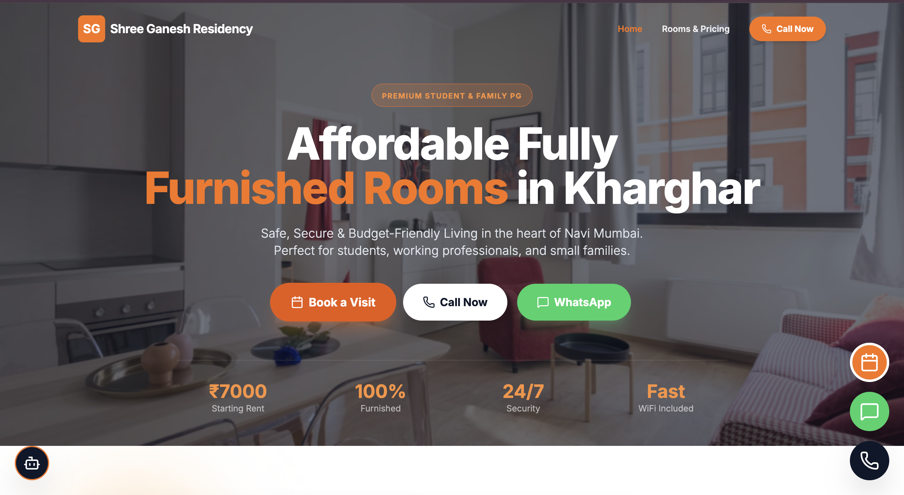

# 🏠 Shree Ganesh Residency

Affordable Fully Furnished Rooms in Kharghar, Navi Mumbai.

---

## 🌐 Live Website
👉 https://divyanshupratapshahi.github.io/shree-ganesh-residency/

---

## 📸 Website Preview

---

## ✨ Features

- 🛏 Fully Furnished Rooms
- 📶 WiFi Included
- 🚗 Parking Available
- 🔐 24/7 Security Guard + CCTV
- 🧺 Washing Machine
- ❄ Refrigerator
- 🔥 Gas Connection
- 💧 Water Purifier
- 🚿 Geyser
- 🧹 Cleaning on Alternate Days
- 💡 Electricity Bill Sharing
- 📍 Prime Location – Kharghar, Belpada
- 💰 Starting ₹7000/month

---

## 🏢 Room Pricing

| Room Type | Rent |
|-----------|------|
| Hall | ₹7000 |
| Bedroom | ₹7500 |
| Attached Washroom Room | ₹8000 |

---

## 📑 Policies

- 1 Month Security Deposit
- 1 Month Notice Period
- Brokerage Applicable
- Maintenance Charges Applicable

---

## 💻 Tech Stack

- React + TypeScript
- Vite
- HTML5
- CSS3
- Responsive Design
- Modern UI Layout

---

## 📱 Responsive Design

✔ Mobile Friendly  
✔ Tablet Optimized  
✔ Desktop Modern Layout  

---

## 📂 Project Structure

## Run Locally

**Prerequisites:**  Node.js

1. Install dependencies:
   `npm install`
2. Set the `GEMINI_API_KEY` in [.env.local](.env.local) to your Gemini API key
3. Run the app:
   `npm run dev`
